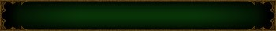

<h1 align="center"></h1>

Hellish Wordle-ish guessing game based on Diablo III - guess the item by its properties!

  

## 📋 Instructions

Search for an item and enter your guess, then check out the correct and incorrect properties. Repeat the process, narrowing down the possibilities until you find the right item!

Revealed properties appear in the item tooltip, like the one to the right. After 10 guesses, a blurred legendary power will also appear, which you may hover over to reveal it.

At any given time, you can hit the *Surrender* button to give up and see answer alongside your amount of guesses, and then simply start fresh with the *New Game* button replacing it.

The background of guessed properties will be either green or red to indicate its correctness as displayed below.

| Correct | Incorrect |
| - | - |
|  |  |

## 📜 Properties

This section covers the 4 properties used to narrow down the possible items and eventually guess the answer, those being the *Quality* of the item, its *Slot* and *Type* in terms of equipment, and finally the *Class* restriction placed on the item.

### ⭐ Qualities

There is a total of 6 possible qualities, consisting of the 5 base qualities *common*, *magic*, *rare*, *legendary* and *set*, as well as Season 24's *ethereal*.

Additionally, you may open the *Qualities* modal to choose what qualities you wish to include in the pool of items, e.g. only *legendary* and *set* items, leaving out the *common*, *magic*, *rare* and *ethereal* ones.

Below is a table of them, each with a description of their respective items included.

| Nameplate | Name | Description |
| - | :-: | - |
|  | Common | Includes only the items intended for transmogrification, e.g. *Star Helm* and *Quinquennial Sword* |
|  | Magic | Includes only special items like *Rakanishu's Blade* and Darkening of Tristram drops like *The Butcher's Cleaver* |
|  | Rare | Includes only the Level 70 craftable items, i.e. *Sovereign* items |
|  | Legendary | Includes all, but only the level 70 version of craftables, e.g. *Unbound Bolt* exists but not *Longshot* |
|  | Set | Includes all, but only the level 70 version of craftables, e.g. *Sage's Passage* exists but not *Sage's Journey* |
|  | Ethereal | Includes all, but item types are treated as their closest D3 equivalents, e.g. *bone knife* is considered a *dagger* |

### 🗡️ Equipment

Equipment makes up the two inner properties for items, *Slot* and *Type*, where the latter is a subset of the former.

Below is a table detailing each item slot as well as its possible item types.

| Slot | Type |
| - | - |
| Head | Helm, Spirit Stone, Voodoo Mask, Wizard Hat |
| Shoulders | Shoulders |
| Torso | Chest Armor, Cloak |
| Wrists | Bracers |
| Hands | Gloves |
| Waist | Belt, Mighty Belt |
| Legs | Pants |
| Feet | Boots |
| Neck | Amulet |
| Finger | Ring |
| Off-Hand | Shield, Crusader Shield, Mojo, Source, Quiver, Phylactery |
| One-Handed | Axe, Dagger, Mace, Spear, Sword, Ceremonial Knife, Fist Weapon, Flail, Mighty Weapon, Scythe |
| Two-Handed | Axe, Mace, Polearm, Staff, Sword, Daibo, Flail, Mighty Weapon, Scythe |

As mentioned in the Qualities subsection, the ethereal item types have been changed, as they do not exist in Diablo 3. Below is another table elaborating the converted item types, excluding *Khalim's Will* and *Soul Harvest* as they already match Diablo 3 item types.

| Type | Ethereal |
| - | - |
| Sword | Doombringer, The Grandfather, Blackhand Key |
| Axe | Gimmershred |
| Mace | Astreon's Iron Ward, The Redeemer |
| Crossbow | Buriza-Do Kyanon |
| Hand Crossbow | Doomslinger |
| Bow | Windforce |
| Fist Weapon | Bartuc's Cut-Throat, Jade Talon, Shadow Killer |
| Dagger | Blackbog's Sharp, Ghostflame, Wizardspike |
| Spear | Arioc's Needle |
| Ceremonial Knife | The Gidbinn |
| Staff | Mang Song's Lesson |
| Wand | The Oculus |

### 📚 Classes

All 7 classes are included, those being the original 5, *Barbarian*, *Demon Hunter*, *Monk*, *Witch Doctor* and *Wizard*, as well as the *Crusader* from *Reaper of Souls* and the *Necromancer* from the DLC *Rise of the Necromancer*.

Additionally *Generic* is included for items that are not class-specific, even if the item is intended for a specific class, e.g. *Wraps of Clarity* is treated as *Generic* despite its legendary power only working for *Demon Hunters*.

Meanwhile hand crossbows will be designated *Demon Hunter* as only that class can equip them. Class sets will be designated their class, even if the item slot may be *Generic*, due to class sets being inherently class-specific, e.g. *Shadow's Bane* is a *Chest Armor* but can only be equipped by *Demon Hunters*.

## 🥇 Records

Your top 10 personal best appears, when opening the modal from the *Records* button. This will display the item guessed, the amount of guesses needed and an indication of the qualities chosen, when the guess was made.

The chosen qualities are displayed using initials, so **C** for commons, **M** for magic items, **R** for rares, **L** for legendaries, **S** for set items and **E** for ethereals. These work similarly to the correct and incorrect background colours, so that a green background means the quality was chosen and a red means it wasn't.

At any time, you can hit the *Clear* button in the records modal to remove all previously set records and start anew.

## 🙌 Support

...is for me? 😳👉👈

